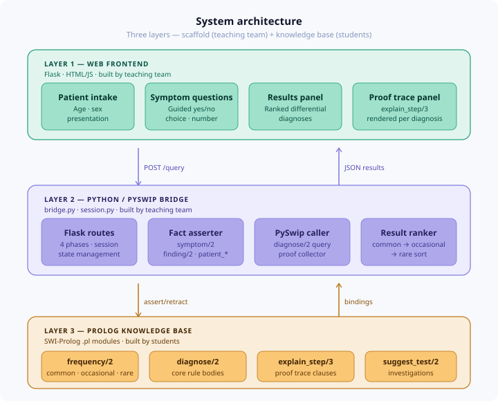
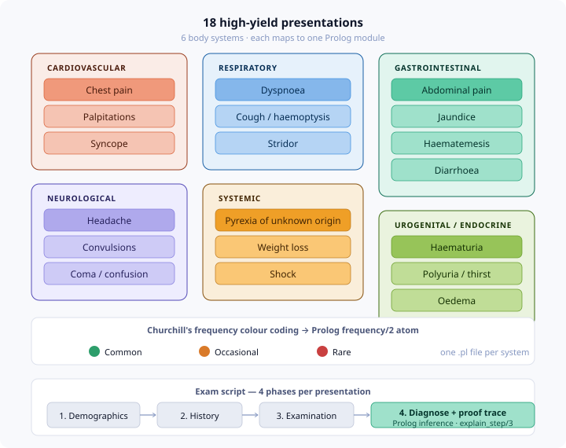

<p align="center">
  
</p>

# Prolog-Based Computer Assisted Diagnosis (CAD) System

A teaching project for the **Biomedical Engineering CAD course**.  
Built with SWI-Prolog · PySwip · Flask · plain HTML/JS.

---

## What this repo is

This system guides a clinician through a structured exam script for **18 high-yield
clinical presentations** drawn from *Churchill's Pocketbook of Differential Diagnosis*.
It collects patient demographics, symptom history, and examination findings, then
queries a Prolog knowledge base to produce ranked differential diagnoses — each with a
**full proof trace** showing exactly which rules fired and why.



The repo is split into two halves:

| Half | Who builds it | What it is |
|------|--------------|-----------|
| **Scaffold** | Teaching team | Web UI, Flask API, PySwip bridge, session management, proof collector |
| **Knowledge base** | **Students** | `.pl` files encoding Churchill's diagnostic rules in Prolog |

---

## Repository layout

```
cad_prolog/
│
├── prolog/
│   ├── loader.pl               # consults all modules; declares dynamic predicates
│   ├── modules/                # ← STUDENTS WORK HERE
│   │   ├── chest_pain.pl       # worked example — read this first
│   │   ├── dyspnoea.pl         # stub
│   │   ├── abdominal_pain.pl   # stub
│   │   └── ... (15 more stubs)
│   └── stubs/
│       └── STUB_TEMPLATE.pl    # copy-paste starting point for each module
│
├── bridge/
│   ├── bridge.py               # PySwip interface: assert facts, run queries, collect proofs
│   └── session.py              # per-request symptom state
│
├── frontend/
│   ├── app.py                  # Flask application, routes
│   ├── templates/
│   │   ├── base.html
│   │   ├── intake.html         # Phase 1: demographics
│   │   ├── history.html        # Phase 2: symptom questions
│   │   ├── examination.html    # Phase 3: examination findings
│   │   └── results.html        # Phase 4: diagnoses + proof trace
│   └── static/
│       ├── css/style.css
│       └── js/exam_script.js
│
├── docs/
│   ├── PROLOG_CONTRACT.md      # ← READ THIS BEFORE WRITING ANY PROLOG
│   ├── PRESENTATIONS.md        # all 18 presentations: causes, questions, findings
│   └── STUDENT_GUIDE.md        # step-by-step walkthrough for students
│
└── tests/
    ├── test_bridge.py          # unit tests for the bridge
    └── test_kb.py              # validate KB: every stub loads, example queries work
```

---

## Quick start

### Prerequisites

```bash
# SWI-Prolog
sudo apt install swi-prolog          # Ubuntu/Debian
brew install swi-prolog              # macOS

# Create a virtual environment with Python 3.12 (using conda)
conda create -n cad_prolog python=3.12
conda activate cad_prolog

# Python packages
pip install -r requirements.txt
```

### Run the app

```bash
cd frontend
python app.py
# Open http://localhost:5000
```

### Run the tests

```bash
pytest tests/
```

---

## Student task overview

0. Follow `docs/WALKTHROUGH.md` (or open `docs/walkthrough.html` in a browser) — this is a self-guided full practice of the system to be xercised before writing any Prolog code.
1. Read `docs/PROLOG_CONTRACT.md` in full. It defines every predicate you must implement.
2. Read `prolog/modules/chest_pain.pl` — the fully worked reference module.
3. Copy `prolog/stubs/STUB_TEMPLATE.pl` into `prolog/modules/` and rename it for your presentation.
4. Fill in the stubs following the contract. Use `chest_pain.pl` as your model.
5. Run `pytest tests/test_kb.py` — all tests must pass before submission.
6. Open a pull request. The PR description should list every diagnosis you encoded and which Churchill's page you used as the source.

---

## The 18 presentations



| System | Presentations |
|--------|--------------|
| Cardiovascular | chest pain · palpitations · syncope |
| Respiratory | dyspnoea · cough + haemoptysis · stridor |
| Gastrointestinal | abdominal pain · jaundice · haematemesis · diarrhoea |
| Neurological | headache · convulsions · coma/confusion |
| Systemic | pyrexia of unknown origin · weight loss · shock |
| Urogenital / Endocrine | haematuria · polyuria + thirst · oedema |

---

## Design principles

**Prolog is the reasoning engine, not a data store.**  
All patient data lives in Python (session dict). Before each query, the bridge
asserts it as dynamic Prolog facts. After the query, all asserted facts are
retracted. This keeps the KB stateless and makes concurrent requests safe.

**Frequency is first-class.**  
Every `diagnose/2` clause takes `Frequency` as its second argument
(`common`, `occasional`, or `rare`). The bridge sorts results by frequency
before display. Students must not omit this — it encodes Churchill's
colour-coding directly.

**Proof transparency is non-negotiable.**  
Every diagnosis must have at least one `explain_step/3` clause per
symptom it depends on. The UI surfaces these as a collapsible proof trace.
A diagnosis without explain steps will render a warning in the UI.

---

## Licence and academic use

Source code: MIT.  
Medical content derived from *Churchill's Pocketbook of Differential Diagnosis*
(3rd edition, Raftery, Lim, Östör — Elsevier 2010). Used for educational purposes only.  
This system is **not** a clinical decision support tool and must not be used for
real patient care.
