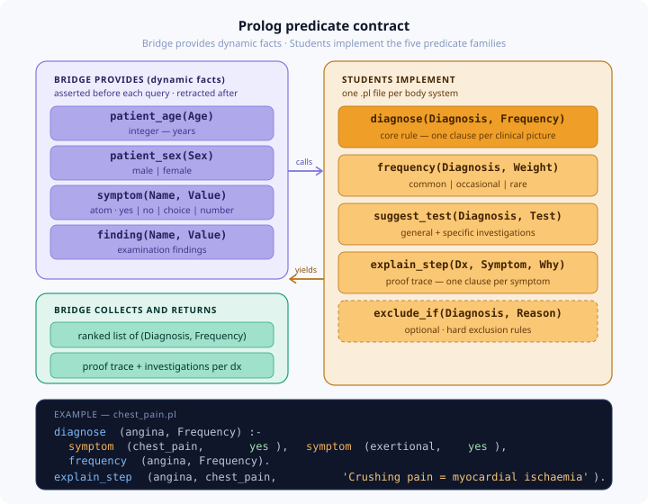

# Prolog Knowledge Base Contract

This document is the **binding specification** for every `.pl` file in
`prolog/modules/`. Read it in full before writing a single line of Prolog.

---



## Overview: what you are building

You are encoding the diagnostic logic from Churchill's Pocketbook into Prolog
rules. The system works in four steps:

```
1. User answers questions in the UI
2. Bridge asserts answers as dynamic Prolog facts
3. Bridge calls diagnose/2  -  Prolog finds all matching diagnoses
4. Bridge calls explain_step/3 for each  -  Prolog returns proof trace
5. Bridge retracts all facts, returns results to UI
```

Your job is steps 3 and 4. You write the rules; the bridge handles everything else.

---

## Facts the bridge provides

Before querying your module, the bridge asserts these dynamic facts.
You may call them freely inside your rules. **Never define them yourself.**

```prolog
% Patient demographics
patient_age(Age).          % integer  -  patient's age in years
patient_sex(Sex).          % atom    -  'male' or 'female'

% Symptom answers (from History phase)
symptom(Name, Value).      % Name: atom  Value: yes | no | mild | moderate | severe
                           % e.g.  symptom(chest_pain, yes)
                           %       symptom(pain_character, crushing)
                           %       symptom(pain_duration_minutes, 30)

% Examination findings (from Examination phase)
finding(Name, Value).      % same convention as symptom/2
                           % e.g.  finding(jvp_elevated, yes)
                           %       finding(breath_sounds, absent_left)
```

> **Key rule:** if the patient was not asked a question, that symptom/finding
> will NOT be asserted. Your rules must tolerate absent facts gracefully.
> Use `symptom(X, yes)` to require a positive answer. Use
> `\+ symptom(X, yes)` to require a symptom is absent or not reported.

---

## Predicates you must implement

### 1. `diagnose/2`  -  the core diagnostic rule

```prolog
diagnose(+Diagnosis:atom, +Frequency:atom) is nondet
```

**The main rule body.** Succeeds (possibly multiple times via backtracking)
with a `Diagnosis` atom and its `Frequency` when the asserted facts match
the clinical picture.

`Frequency` must be one of: `common`, `occasional`, `rare`
(corresponding to Churchill's green / orange / red colour coding).

```prolog
% Pattern:
diagnose(Diagnosis, Frequency) :-
    <symptom and finding checks>,
    frequency(Diagnosis, Frequency).
```

Rules for a single presentation live in a single file. A file may contain
many `diagnose/2` clauses  -  one per diagnosis you are encoding.

**Example (chest_pain.pl):**

```prolog
diagnose(angina, Frequency) :-
    symptom(chest_pain, yes),
    symptom(pain_character, crushing),
    symptom(exertional, yes),
    frequency(angina, Frequency).

diagnose(mi, Frequency) :-
    symptom(chest_pain, yes),
    symptom(pain_character, crushing),
    symptom(exertional, no),          % occurs at rest
    symptom(pain_duration_minutes, D),
    D >= 20,
    frequency(mi, Frequency).
```

---

### 2. `frequency/2`  -  static frequency table

```prolog
frequency(+Diagnosis:atom, ?Frequency:atom) is det
```

A simple lookup fact. One clause per diagnosis. Values: `common`,
`occasional`, `rare`.

```prolog
% Example (chest_pain.pl):
frequency(angina,              common).
frequency(mi,                  common).
frequency(pericarditis,        occasional).
frequency(aortic_dissection,   occasional).
frequency(oesophageal_spasm,   occasional).
frequency(pneumothorax,        occasional).
frequency(pulmonary_embolism,  occasional).
frequency(costochondritis,     common).
frequency(depression,          occasional).
```

Source: Churchill's colour coding. When in doubt, use `occasional`.

---

### 3. `suggest_test/2`  -  recommended investigations

```prolog
suggest_test(+Diagnosis:atom, -Test:atom) is nondet
```

Succeeds for each test the clinician should consider for a given diagnosis.
Tests come from Churchill's **GENERAL INVESTIGATIONS** and
**SPECIFIC INVESTIGATIONS** sections.

Use short, readable atoms. The UI displays them verbatim.

```prolog
% Example (chest_pain.pl):
suggest_test(angina,            ecg).
suggest_test(angina,            exercise_stress_test).
suggest_test(angina,            coronary_angiography).
suggest_test(mi,                ecg).
suggest_test(mi,                serum_troponin).
suggest_test(mi,                fbc).
suggest_test(mi,                cxr).
suggest_test(pulmonary_embolism, vq_scan).
suggest_test(pulmonary_embolism, ct_pulmonary_angiography).
suggest_test(pulmonary_embolism, ecg).
suggest_test(pulmonary_embolism, d_dimer).
```

---

### 4. `explain_step/3`  -  proof trace (required for every diagnosis)

```prolog
explain_step(+Diagnosis:atom, +Symptom:atom, -Rationale:atom) is nondet
```

This is what makes the proof trace work. For every symptom or finding that
your `diagnose/2` rule depends on, you must write a corresponding
`explain_step/3` clause that explains **why** that finding points toward
that diagnosis.

`Rationale` is a human-readable atom (a sentence, quoted with single quotes
if it contains spaces).

```prolog
% Example (chest_pain.pl):
explain_step(angina, chest_pain,
    'Central crushing chest pain is the hallmark of myocardial ischaemia').
explain_step(angina, exertional,
    'Angina is classically precipitated by exertion due to increased myocardial oxygen demand').
explain_step(angina, pain_character,
    'Crushing or tight character distinguishes ischaemic pain from pleuritic or musculoskeletal causes').

explain_step(mi, chest_pain,
    'Severe crushing chest pain is the cardinal symptom of myocardial infarction').
explain_step(mi, exertional,
    'MI occurs at rest, distinguishing it from stable angina').
explain_step(mi, pain_duration_minutes,
    'Pain lasting 20+ minutes at rest strongly suggests infarction rather than angina').

explain_step(pulmonary_embolism, chest_pain,
    'Pleuritic chest pain occurs when infarction involves the pleural surface').
explain_step(pulmonary_embolism, dyspnoea,
    'Sudden dyspnoea is the most common symptom of PE  -  ventilation-perfusion mismatch').
explain_step(pulmonary_embolism, haemoptysis,
    'Blood-stained sputum indicates pulmonary infarction, present in ~30% of PE cases').
```

> **Rule:** if `diagnose/2` checks `symptom(X, yes)`, you must have
> `explain_step(Diagnosis, X, _)`. The test suite enforces this.

---

### 5. `exclude_if/2`  -  hard exclusion rules (optional but encouraged)

```prolog
exclude_if(+Diagnosis:atom, -Reason:atom) is nondet
```

Encodes hard clinical exclusions  -  situations where a diagnosis is
**ruled out** regardless of other findings. The bridge checks these after
collecting diagnoses and removes any that are excluded.

Using `exclude_if/2` teaches you about **negation-as-failure** in Prolog.

```prolog
% Example (chest_pain.pl):
exclude_if(mi, 'ECG shows no changes and troponin negative at 12 hours') :-
    finding(ecg_changes, no),
    finding(troponin_elevated, no).

exclude_if(aortic_dissection, 'Symmetric pulses make dissection unlikely') :-
    finding(pulse_asymmetry, no).
```

---

## Naming conventions

### Diagnosis atoms

Use lowercase with underscores. Spell out abbreviations.

| Preferred | Avoid |
|-----------|-------|
| `myocardial_infarction` or `mi` | `MI`, `M_I`, `heartattack` |
| `pulmonary_embolism` | `pe`, `PE` |
| `subarachnoid_haemorrhage` | `SAH` |

Be consistent within a file  -  if you use `mi` in `diagnose/2`, use `mi`
everywhere for that diagnosis.

### Symptom and finding atoms

Symptom names are shared across modules  -  the bridge generates them from
the UI question definitions in `frontend/app.py`. Use the exact atoms
listed in `docs/PRESENTATIONS.md` for your presentation.

---

## File structure

Each module file must follow this structure exactly:

```prolog
/* ============================================================
   MODULE: <presentation name>
   SOURCE: Churchill's Pocketbook, 3rd ed., p. <page number>
   AUTHORS: <student names>
   ============================================================ */

:- module(<module_name>, [diagnose/2, frequency/2,
                           suggest_test/2, explain_step/3,
                           exclude_if/2]).

:- encoding(utf8).   % required for Spanish accented characters in rationale strings

% ---------- frequency table ----------
frequency(...).
...

% ---------- diagnostic rules ----------
diagnose(...) :- ...
...

% ---------- investigations ----------
suggest_test(...).
...

% ---------- proof trace ----------
explain_step(...).
...

% ---------- exclusions (optional) ----------
exclude_if(...) :- ...
```

---

## What the bridge does with your predicates

```python
# Pseudocode of bridge.py query cycle:

# 1. Assert patient facts
for name, value in session.symptoms.items():
    assertz(symptom(name, value))

# 2. Collect all diagnoses
results = list(prolog.query("diagnose(D, F)"))
# → [{'D': 'angina', 'F': 'common'}, {'D': 'mi', 'F': 'common'}, ...]

# 3. Remove excluded diagnoses
results = [r for r in results if not excluded(r['D'])]

# 4. For each diagnosis, collect proof steps
for r in results:
    r['proof'] = list(prolog.query(
        f"explain_step({r['D']}, S, Rationale)"
    ))

# 5. Collect investigations
for r in results:
    r['tests'] = list(prolog.query(f"suggest_test({r['D']}, T)"))

# 6. Sort: common first, then occasional, then rare
# 7. Retract all asserted facts
# 8. Return results
```

---

## Test suite contract

Your module must pass these automated checks in `tests/test_kb.py`:

1. **Loads without error**  -  `prolog.consult('your_module.pl')` succeeds
2. **diagnose/2 fires at least once** per presentation for a canonical symptom set
3. **Every diagnosis has a frequency**  -  `frequency(D, _)` succeeds for every `D` that `diagnose/2` can produce
4. **explain_step coverage**  -  for every symptom checked in `diagnose/2`, a matching `explain_step/3` exists
5. **suggest_test coverage**  -  every diagnosis has at least one test
6. **No singleton variables**  -  Prolog compiler warnings are treated as errors

---

## Common mistakes

**Forgetting `frequency/2`**  
`diagnose(angina, Frequency)` will silently fail if `frequency(angina, _)` is not defined.
Always write the frequency table *first*, then the rules.

**Hard-coding frequency in diagnose/2**  
```prolog
% Wrong:
diagnose(angina, common) :- ...

% Right:
diagnose(angina, Frequency) :-
    ...,
    frequency(angina, Frequency).
```
The second form lets you change frequency without touching every rule.

**Missing explain_step for a symptom your rule checks**  
If `diagnose(angina, _)` checks `symptom(exertional, yes)` but there is no
`explain_step(angina, exertional, _)`, the proof trace for that step will be
empty. The test suite will catch this.

**Using `assert` inside rules**  
Never call `assert/1` or `retract/1` inside your diagnostic rules.
The bridge manages the fact lifecycle. Your rules are pure.
