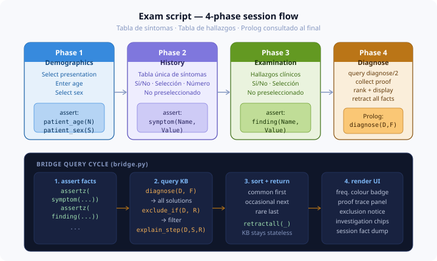

# Student guide

This guide walks you through building your Prolog module from scratch.
By the end, your module will plug directly into the running web application
and generate diagnoses with full proof traces.

---



## Before you start

1. **Install SWI-Prolog** and verify it works:
   ```bash
   swipl --version
   ```
2. **Install Python dependencies:**
   ```bash
   pip install pyswip flask flask-session pytest
   ```
3. **Clone the repo** and confirm the reference module works:
   ```bash
   pytest tests/test_kb.py::test_chest_pain_reference_module -v
   ```
   You should see `PASSED`. If not, check your SWI-Prolog installation.

---

## Step 1  -  Choose your presentation

Your instructor will assign one presentation from the list in `README.md`.
Find its entry in `docs/PRESENTATIONS.md`  -  this gives you the diagnoses,
symptom atoms, and finding atoms you will use.

Your assigned presentation: _______________

Churchill's page number: _______________

---

## Step 2  -  Read the worked example

Open `prolog/modules/chest_pain.pl` and read it in full. Pay attention to:

- How `frequency/2` is defined *before* the rules (the rules call it)
- How `diagnose/2` always ends with `frequency(Diagnosis, Frequency)`
- How `explain_step/3` has one clause per symptom per diagnosis
- How `exclude_if/2` uses `finding/2` to hard-rule-out diagnoses

Also read `docs/PROLOG_CONTRACT.md`  -  the test suite enforces this contract.

---

## Step 3  -  Copy the stub

```bash
cp prolog/stubs/STUB_TEMPLATE.pl prolog/modules/<your_presentation>.pl
```

Or use the pre-populated stub for your presentation if one exists in
`prolog/stubs/` (e.g. `headache.pl`).

---

## Step 4  -  Fill in Section 1: frequency table

Before writing any rules, fill in `frequency/2` for every diagnosis
you plan to encode. Use Churchill's colour coding:

- Green bullet → `common`
- Orange bullet → `occasional`
- Red bullet → `rare`

Example:
```prolog
frequency(tension_headache,  common).
frequency(migraine,          common).
frequency(meningitis,        occasional).
```

**Why first?** Your `diagnose/2` rules call `frequency/2`  -  if it's not
defined, the rule will silently fail and you'll wonder why nothing fires.

---

## Step 5  -  Write diagnose/2 rules

For each diagnosis, write one (or more) `diagnose/2` clause encoding the
clinical picture from Churchill's HISTORY and EXAMINATION sections.

**Template:**
```prolog
diagnose(my_diagnosis, Frequency) :-
    symptom(key_symptom, yes),
    symptom(another_symptom, yes),
    \+ symptom(excluding_symptom, yes),   % optional negation
    frequency(my_diagnosis, Frequency).
```

**Tips:**
- Start with the most specific symptom. Prolog tries it first.
- Use `\+` (not provable) to encode "absence of a symptom".
- You can have multiple clauses for one diagnosis  -  each encodes a
  different clinical variant.
- Check the symptom atoms in `docs/PRESENTATIONS.md`. Use them exactly.

**Testing as you go:**
```bash
# In SWI-Prolog interactive:
swipl prolog/modules/your_module.pl
?- assertz(patient_age(35)), assertz(symptom(headache, yes)), assertz(symptom(onset, sudden)).
?- diagnose(D, F).
```

---

## Step 6  -  Write suggest_test/2 facts

Look at Churchill's **GENERAL INVESTIGATIONS** and **SPECIFIC INVESTIGATIONS**
sections for your presentation. Add one fact per (diagnosis, test) pair.

```prolog
suggest_test(meningitis,  ct_head).
suggest_test(meningitis,  lumbar_puncture).
suggest_test(meningitis,  blood_cultures).
suggest_test(meningitis,  fbc).
```

Use short, readable atoms. The UI displays them as-is (with underscores
replaced by spaces).

---

## Step 7  -  Write explain_step/3 clauses

For every symptom your `diagnose/2` rules check, write an `explain_step/3`
clause explaining *why* that symptom points toward that diagnosis.

```prolog
explain_step(meningitis, neck_stiffness,
    'Neck stiffness (meningism) results from irritation of the meningeal membranes').
explain_step(meningitis, photophobia,
    'Photophobia reflects meningeal irritation  -  light increases intracranial pressure').
explain_step(meningitis, fever,
    'Fever indicates the systemic inflammatory response to bacterial or viral infection').
```

The rationale string is what the user reads in the proof trace panel.
Write it as a clinician would explain it to a student.

**Caracteres acentuados — añada `:- encoding(utf8).`**
Si sus cadenas de justificación contienen caracteres acentuados en español
(á, é, í, ó, ú, ñ), SWI-Prolog emitirá advertencias "Illegal multibyte Sequence"
a menos que el archivo declare su codificación. La línea `:- encoding(utf8).`
ya está incluida en cada stub — no la elimine.

**Common mistake:** forgetting to quote the rationale string when it contains
spaces. In Prolog, single-quoted strings are atoms:
```prolog
% Wrong:
explain_step(migraine, aura, Visual disturbance precedes migraine pain in aura type).
% Right:
explain_step(migraine, aura, 'Visual disturbance precedes migraine pain in aura type').
```

---

## Step 8  -  Write exclude_if/2 rules (optional but graded)

Encode at least one hard exclusion. Think about: what finding would
definitively rule out a diagnosis you've encoded?

```prolog
exclude_if(migraine, 'Papilloedema suggests raised ICP  -  space-occupying lesion must be excluded first') :-
    finding(papilloedema, yes).
```

---

## Step 9  -  Run the test suite

```bash
pytest tests/test_kb.py -v
```

All of these must pass before submission:

- `test_module_loads[your_module.pl]`
- `test_canonical_case_fires[your_presentation-...]` *(if canonical case defined)*
- `test_all_diagnoses_have_frequency[your_module.pl]`
- `test_all_diagnoses_have_tests[your_module.pl]`
- `test_explain_step_exists_for_each_diagnosis[your_module.pl]`

If a test fails, read the error message carefully  -  it tells you exactly
which predicate is missing for which diagnosis.

---

## Step 10  -  Uncomment your module in loader.pl

Open `prolog/loader.pl` and uncomment the line for your presentation:

```prolog
:- use_module('modules/headache').   % ← uncomment this line
```

Then run the app and test your module end-to-end:
```bash
cd frontend && python app.py
# Open http://localhost:5000 and select your presentation
```

---

## Step 11  -  Submit a pull request

Your PR must include:
1. Your `.pl` file in `prolog/modules/`
2. Your module line uncommented in `prolog/loader.pl`
3. PR description listing every diagnosis you encoded and the Churchill's
   page number you used as the source

**Marking rubric:**

| Criterion | Marks |
|-----------|-------|
| Module loads and tests pass | 20% |
| Diagnoses accurately reflect Churchill's | 25% |
| explain_step/3 rationales are clinically meaningful | 25% |
| Frequency coding matches Churchill's colour coding | 10% |
| At least one exclude_if/2 rule | 10% |
| Code quality (clear naming, no singleton warnings) | 10% |

---

## Common Prolog errors and how to fix them

**`ERROR: Unknown procedure: diagnose/2`**  
Your module declaration is wrong. Check the `:- module(name, [...])` line
includes `diagnose/2`.

**`Warning: Singleton variables`**  
A variable appears only once in a clause. Either use it or replace with `_`:
```prolog
% Wrong:  (X is never used)
diagnose(migraine, Frequency) :- symptom(headache, yes), frequency(migraine, Frequency).

% Fine  -  if you don't need the value, use _
diagnose(migraine, Frequency) :- symptom(headache, _), frequency(migraine, Frequency).
```

**`diagnose/2 fires but no explain_step found`**  
Run this in SWI-Prolog to check:
```prolog
?- explain_step(your_diagnosis, _, _).
```
If it fails, you're missing the clauses. Add one per symptom.

**Rule fires when it shouldn't**  
Add more specific symptom conditions to narrow the rule. Use the
`\+` operator to require the *absence* of a discriminating symptom.
